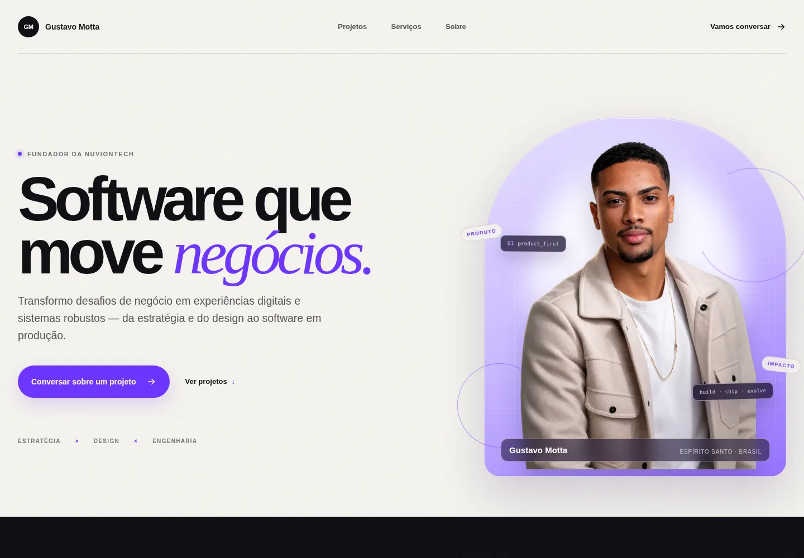

# Gustavo Motta — Portfolio



Portfolio pessoal de **Gustavo Motta**, fundador da **NuvionTech**. Uma experiência editorial para apresentar projetos reais em estratégia, design e engenharia de software.

## Projetos em destaque

| Projeto | Descrição | Site |
| --- | --- | --- |
| ATA CRM | Landing page para uma plataforma B2B de atendimento, relacionamento e automações | [crm.atasistemas.com.br](https://crm.atasistemas.com.br) |
| ATA Ponto | Experiência comercial para soluções de controle de jornada | [ponto.atasistemas.com.br](https://ponto.atasistemas.com.br) |
| ATA Segurança | Apresentação de soluções de segurança eletrônica para empresas | [seguranca.atasistemas.com.br](https://seguranca.atasistemas.com.br) |
| ATA Acesso | Landing page para controle de acesso e fluxo corporativo | [acesso.atasistemas.com.br](https://acesso.atasistemas.com.br) |

Os cases usam capturas reais nas versões desktop e mobile, apresentadas em dispositivos animados com rolagem completa do projeto.

## Stack

- Next.js 16
- React 19
- TypeScript
- CSS responsivo e animações nativas
- OpenNext para build de produção

## Qualidade

- HTML semântico e navegação por teclado
- Layouts próprios para desktop e mobile
- Suporte a `prefers-reduced-motion`
- Imagens otimizadas em WebP
- Metadados de SEO, Open Graph e JSON-LD
- Lint, verificação de tipos e build de produção

## Executar localmente

Requisitos: Node.js 20 ou superior.

```bash
npm install
npm run dev
```

Acesse [http://localhost:3000](http://localhost:3000).

## Verificações

```bash
npm run lint
npm run typecheck
npm run build
```

## Contato

Para conversar sobre um projeto, utilize o [WhatsApp](https://wa.me/5527997498818).
